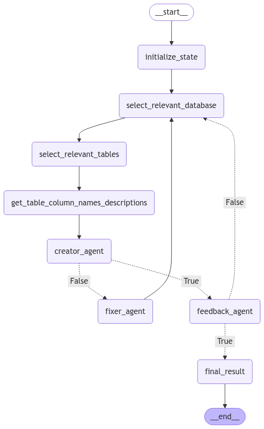

# LLMsAgents-TextToSQL
Repository for an agent-based system that converts natural language queries to SQL

### Setup
This project uses poetry for dependency management, so make sure you have it installed. After that, simply run `make initial-setup` from the root directory of the project.

The test_bird.py file in the setup folder is called from within the setup.py script and contains sample code to establish a connection to the sqlite databases and execute queries against them.

Paper:

- CodeS: https://arxiv.org/abs/2402.16347
- Bird: https://arxiv.org/abs/2305.03111
- ChaseSQL: https://arxiv.org/abs/2410.01943
